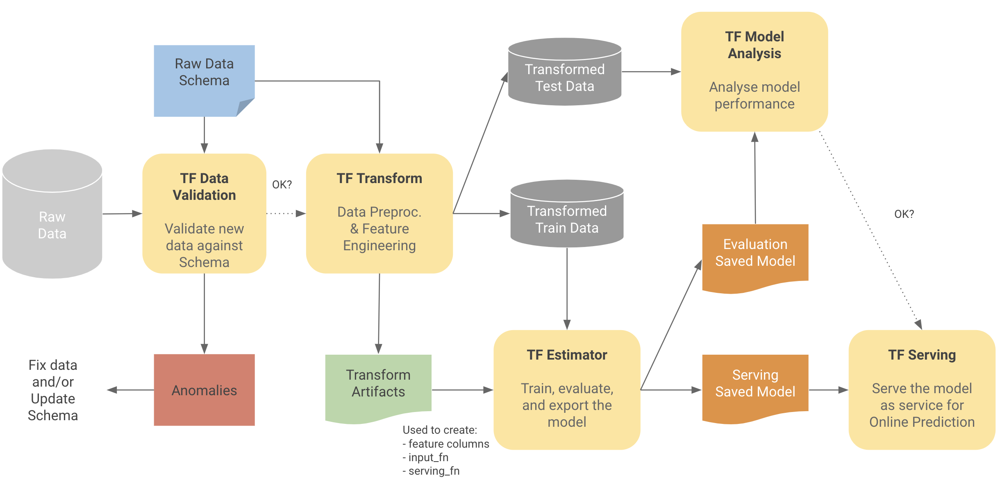

# Machine Learning with TensorFlow Extended
The puprpose of these labs is to show how to do end-to-end ML with TensorFlow Extended (TFX) libraries. The labs covers:

1. Data analysis and shcema generation with [TensorFlow Data Validation](https://www.tensorflow.org/tfx/guide/tfdv) (TFDV).
2. Data preprcessing with [TensorFlow Transform](https://www.tensorflow.org/tfx/guide/tft) (TFT).
3. Model training and evaluation with TensorFlow [Estimator API](https://www.tensorflow.org/api_docs/python/tf/estimator/Estimator).
4. Model validation with [TensorFlow Model Analysis](https://www.tensorflow.org/tfx/guide/tfma) (TFMA)

The dataset used in these labs is the UCI Adult Dataset: https://archive.ics.uci.edu/ml/datasets/adult
It is a classification dataset, where the task is to predict whether income exceeds 50K USD per yearr based on census data. It is also known as "Census Income" dataset.