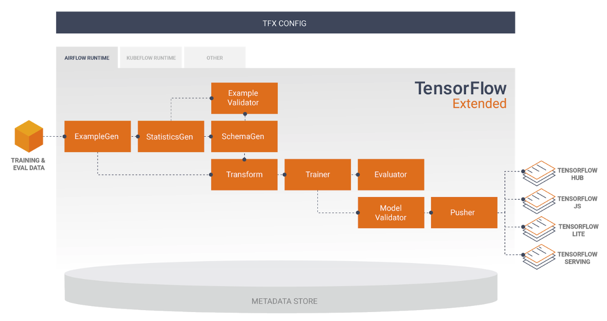

# Machine Learning with TFX Pipelines

The purpose of this lab is to build and end-to-end ML pipeline using TensorFlow Extended (TFX) Components, and leverage thier integration with ML Metadata.

The dataset used in these labs is the **UCI Adult Dataset**: https://archive.ics.uci.edu/ml/datasets/adult.

It is a classification dataset, where the task is to predict whether income exceeds 50K USD per yearr based on census data. It is also known as "Census Income" dataset.