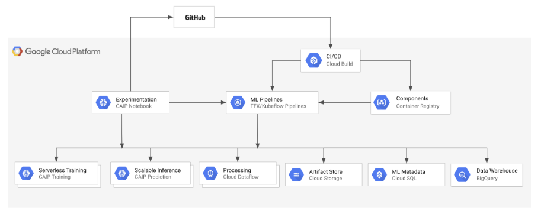

# Orchestrating and running ML TFX pipelines with KFP and Cloud AI Platform

In these labs, we will develop, deploy and run a TFX pipeline that uses [Kubeflow Pipelines](https://www.kubeflow.org/docs/pipelines/) for orchestration, and Cloud Dataflow and Cloud AI Platform Services for data processing, training, and serving.

In addition, we will walk through authoring of a Cloud Build CI/CD workflow that automatically builds and deploys a TFX pipeline. You will also integrate your workflow with GitHub by setting up a trigger that starts the workflow when a new tag is applied to the GitHub repo hosting the pipeline's code.

## MLOps environment on GCP

The environment is configured to support effective development and operationalization of production grade ML workflows with TFX and KFP.

The core services in the environment are:

1. ML experimentation and development - AI Platform Notebooks
2. Scalable, serverless model training - AI Platform Training
3. Scalable, serverless model serving - AI Platform Prediction
4. Distributed data processing - Dataflow
5. Analytics data warehouse - BigQuery
6. Artifact store - Google Cloud Storage
7. Machine learning pipelines - TensorFlow Extended (TFX) and Kubeflow Pipelines (KFP)
8. Machine learning metadata management - ML Metadata on Cloud SQL
9. CI/CD tooling - Cloud Build